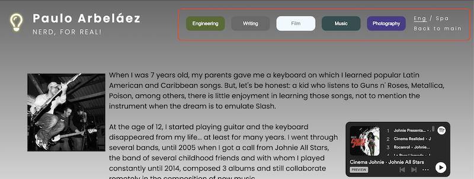

# Welcome to my portfolio

It is difficult for me to correctly show all my capabilities in a single CV, therefore, I decided to create a portfolio with all my working experience and hobbies with which I can make a living, or could be useful for the visitors of the webpage interests.

[View My Portfolio on GitHub Pages](https://parbelaez.github.io/personal-portfolio/)

## What's new in this version?

- Complete redesign of the webpage, with a new header blending with the background of the page.
- New logo, with an animation of the lightbulb turning on and off.
- New menu for desktop, with a hover effect on the links.
- New hamburger menu, with an animation of the lines turning into an X.
- New hover effect on the tiles, making them more 3D realistic.
- Bigger font size for better readability.
- Writing page: added thumbnails of the articles I have written, with a link to the original article in pdf format.

## UI / UX Concept

As the portfolio is eclectic, it should be as clear and simple as possible.

The logo was inspired by an AI-generated one from [LOOKA](https://looka.com/) but created manually using Google fonts and [Fontawesome](https://fontawesome.com/) icons.

The color scheme is based on different shades of grey, except for the tiles, which were thought of as pastel-color items, so their inherent opacity matches the seriousness of the header and the footer.

In this new version of the webpage, the logo has an animation that makes it more dynamic. The animation was created using [CSS Keyframes](https://developer.mozilla.org/en-US/docs/Web/CSS/@keyframes), and it is of the lightbulb turning on and off.

### Fonts

Google Fonts is the source of the typography:

[Poppins](https://github.com/itfoundry/poppins) is a geometric sans serif typeface developed by Indian Type Foundry and Jonny Pinhorn.

### Icons and images

Icons were used directly from [Fontawesome](https://fontawesome.com/).

Images were obtained from my archive and [Pexels](https://www.pexels.com/)

### Menu

A new common menu can be found on all the pages, with a hover effect on the links.
This menu will change the previous concept to a more easy-to-navigate one.
The back to main was kept, but it is (obviously) only visible on the pages that are not the main.

The effect on the hover replicates the animation of the lightbulb to keep consistency with the logo.

This menu is only visible on desktop devices, and it is hidden on smaller screens, for which a hamburger menu was added.

#### Hamburger Menu

To avoid using JavaScript for this project, it was decided to create a hamburger menu by only using HTML and CSS. The code came from the YouTuber Kyle Cook of Web Dev Simplified.

[How To Build An Animated Hamburger Menu With Only CSS](https://www.youtube.com/watch?v=dAIVbLrAb_U).

As can be seen, the hamburger consists of a non-visible checkbox to be used as a button. If a button were used instead, JavaScript would have been needed to catch the click event.

The hamburger menu is only visible on mobile devices, and it is hidden on larger screens.

---

## Content Pages

### index.html -landing page-

I chose to use a tiling system in the index to be similar to a mobile app, with an icon, title, catchphrase, and a brief description. I considered this approach to be the best to give each section the same importance.

The footer is composed as well of icons of my normally used social networks that could help the user know more about my work.

### Engineering

This one was used to practice the usage of the background image, and the hover displaying an image on the word: probe.

### Writing

This is an almost only-text webpage. For this new webpage version, I included thumbnails of some articles I have written, so the visitor can have a better idea of the content. Plus, each one of them redirects to the original article in pdf format.

### Film

For this page, YouTube iframes were used, so the visitor can check part of my multimedia work.

### Music

For this page, Spotify iframes were used, along with a copyrighted photo with its corresponding mention.
Some audio clips can be inserted in the future, as the work on the album progresses.

### Photography

A set of personal photos. Some of them are not part of my Instagram account.
Flexbox was used to create the matrix.

## Deployment & Local Development

### Deployment

The GitHub Pages feature was used to deploy the live website. The instructions to achieve this are below:

1. Log in (or sign up) to Github.
2. Find the repository for this project, _personal-portfolio_.
3. Click on the Settings link.
4. Click on the Pages link in the left-hand side navigation bar.
5. In the Source section, choose main from the drop-down select branch menu. Select Root from the drop-down select folder menu.
6. Click Save. Your live Github Pages site is now deployed at the URL shown.

### Development

All development for the first version was done in [Code Anywhere](https://app.codeanywhere.com/).
The second version was developed in [Visual Studio Code](https://code.visualstudio.com/).

#### How to Fork

To fork the personal-portfolio repository:

1. Log in (or sign up) to Github.
2. Go to the repository for this project, parbelaez/personal-portfolio.
3. Click the Fork button in the top right corner.

#### How to Clone

To clone the personal-portfolio repository:

1. Log in (or sign up) to GitHub.
2. Go to the repository for this project, parbelaez/personal-portfolio.
3. Click on the code button, select whether you would like to clone with HTTPS, SSH or GitHub CLI and copy the link shown.
4. Open the terminal in your code editor and change the current working directory to the location you want to use for the cloned directory.
5. Type 'git clone' into the terminal and then paste the link you copied in step 3. Press enter.

## Bug reports and errors

### Known bugs

- Firefox still does not support the 'has' selector, so the hamburger menu is not working properly in this browser, unless 'has' is manually activated in the browser's settings.

[How to activate 'has' in Firefox](https://developer.mozilla.org/en-US/docs/Web/CSS/:has)

### Fixed bugs

- Images not loading due to the wrong path.
- "a" attribute is given mistakenly to the image contained in it.
- Resizing issues due to the min-max height threshold not being defined.
- The hamburger menu was not working properly on the engineering page. As there was z-index used, the hamburger needed one that is higher than the rest of the elements.
- The hamburger menu was not working properly on the film page. It was due to an incorrect label assigned to the input.

### HTML Errors

- The w3c html validation is considered to be OK, as the errors are coming directly from the iframes given by the YouTube and Spotify codes.

YouTube: *"Error: The frameborder attribute on the iframe element is obsolete. Use CSS instead."*

Spotify: *"Error: Bad value 100% for attribute width on element iframe: Expected a digit but saw % instead.*

### CSS Errors

- The w3c html validation is considered OK, as the errors are coming directly from the fonts and icons imports from Google Fonts and Fontawesome.

## Credits

[Engineering image](https://www.pexels.com/de-de/foto/person-die-das-gerat-verwendet-132700/)

The musician's image was directly given to me by [Julián Gaviria](https://www.linkedin.com/in/julian-gaviria-29584272/?originalSubdomain=co) for personal use.

---

## Testing

All links (internal and external) were tested, as well as the interaction with the languages.
