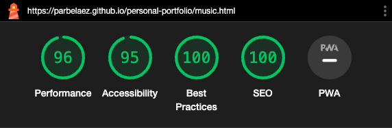

# TESTING

## VALIDATION

### HTML

#### W3C HTML Validator Errors

- music.html, music-es.html

  - _Bad value 100% for attribute width on element iframe: Expected a digit but saw % instead._

  **Reason:** The width of the iframe is set to 100% so it can be responsive. The validator does not recognize this as a valid value.

  - _The frameborder attribute on the iframe element is obsolete. Use CSS instead._

  **Reason:** The frameborder attribute is used to remove the border of the iframe and comes directly from the html embedded link provided by Spotify.

#### W3C HTML Validator Warnings

- index.html, index-es.html

  - _Consider using the h1 element as a top-level heading only (all h1 elements are treated as top-level headings by many screen readers and other tools)._ - [W3C Validator](https://validator.w3.org/nu/?doc=https%3A%2F%2Fjosepmdc.github.io%2Fpersonal-portfolio%2Findex.html)

  **Reason:** the heading and the welcome message are both h1 elements, as they are both the first thing the user will see when entering the page, and they are both top-level headings in their own porpuses.

- engineering.html, engineering-es.html, writing.html, writing-es.html, music.html, music-es.html

  - _Article lacks heading. Consider using h2-h6 elements to add identifying headings to all articles._ - [W3C Validator](https://validator.w3.org/nu/?doc=https%3A%2F%2Fjosepmdc.github.io%2Fpersonal-portfolio%2Fengineering.html)

  **Reason:** the design of the page does not allow for a heading to be added without breaking it.

### CSS

#### W3C CSS Validator Errors

- style.css

The validator does not recognize the has property, probably, becasue is still not 100% supported by Firefox (desktop):


**NOTE:** the translate error seems to be also related to not being completely supported by some mobile browsers. Nevertheless, I tested the page on Safari, Chrome, Edge and Firefox on iPhone 12 pro and iPad, and it worked as expected.


Running a basic statement on the direct input, the validator throws the same error:


## MANUAL TESTING

### Testing User Stories

| Goals | How are they achieved? | Image |
| :--- | :--- | :--- |
| As a visitor, I want to know clearly what is the page about. | A welcome message was included right after the header. In it, there is a clear indication that it is a personal portfolio, and that by clicking on the tiles, information about that specific topic will be displayed.| |
| As a visitor from a Spanish speaking region, I would like to have the chance of having the page in my language. | There is a Eng / Spa links set that will switch between languages in each page|  |
|As a visitor, on top of having the tiles, I would like to have a menu on each page that could lead me directly to any topic. | Every page has a new menu with the topics and following the same color code of the index.html | |
|As a visitor on mobile devices, I would like to have a menu on each page that could lead me directly to any topic. | Every page has a new hamburger menu with the topics and following the same color code of the index.html |   |
|As a visitor, I would like to have some kind of interactivity and movement in the page, so it is not as boring as a normal CV. | - The logo has a new animated lightbulb. <br> - The menu has some hover animation that follows the lighbulb idea. <br> - The tiles are now having a 3D hover effect. <br> - The probe in the engineering page is display as the user hover over the word. <br> - The music page has some embedded Spotify players for the albums. |     |

- - -

### Full Testing

Full testing was performed on the following devices:

- Laptop:
  - Macbook Pro 2022 16 inch screen
  - Lenovo Y510pa
  - iPhone 12 pro
  - iPad Air 4th generation

Each device tested the site using the following browsers:

- Google Chrome
- Safari
- Firefox
- Edge

Additional testing was taken by friends and family on a variety of devices and screen sizes.

Feature | Expected Outcome | Testing Performed | Result | Pass/Fail |
| --- | --- | --- | --- | --- |
| All links in the menu are leading to the correspondent page AND in the right language | - All should lead correctly using the same window or tab. | Clicked on all of them switching between languages | All worked as expected | Pass |
| Hamburger menu | It should open and close as expected, and all links must work. | Tested it on all browser, but, as Firefox still does not support the "has" selector, it is not working on this browser. Firefox has stated that it should be available soon. <br>  | All worked as expected, except in Firefox. | Pass except on Firefox |
| The hamburger menu should be available only for mobile devices, or after the resolution makes it impossible to keep using the normal menu. | - After certain resolution has been reached, the normal menu should disappear, and the hamburger menu should be visible. | Tested on different devices and, while on a laptop/desktop changed the resolution until the 1020px width resolution is reached.<br>  | All worked as expected | Pass |

Back to [README.md](README.md)

- - -

### LIGHTHOUSE TESTING

#### index.html


#### engineering.html


As it can be seen in the snippet below, the image has an explicit width attribute (no height because the width should suffice).

```css
.thumb img {
    width: 350px;
}
```

The server change should be tackled by the hosting provider, as it is not possible to change it from the code.

#### writing.html


#### film.html


#### music.html



#### photography.html


