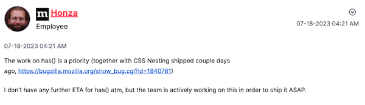

# TESTING

## MANUAL TESTING

### Testing User Stories

| Goals | How are they achieved? | Image |
| :--- | :--- | :--- |
| As a visitor, I want to know clearly what is the page about. | A welcome message was included right after the header. In it, there is a clear indication that it is a personal portfolio, and that by clicking on the tiles, information about that specific topic will be displayed.| |
| As a visitor from a Spanish speaking region, I would like to have the chance of having the page in my language. | There is a Eng / Spa links set that will switch between languages in each page|  |
|As a visitor, on top of having the tiles, I would like to have a menu on each page that could lead me directly to any topic. | Every page has a new menu with the topics and following the same color code of the index.html | |
|As a visitor on mobile devices, I would like to have a menu on each page that could lead me directly to any topic. | Every page has a new hamburger menu with the topics and following the same color code of the index.html |   |
|As a visitor, I would like to have some kind of interactivity and movement in the page, so it is not as boring as a normal CV. | - The logo has a new animated lightbulb.   - The menu has some hover animation that follows the lighbulb idea.   - The tiles are now having a 3D hover effect.   - The probe in the engineering page is display as the user hover over the word.   - The music page has some embedded Spotify players for the albums. |     |

- - -

### Full Testing

Full testing was performed on the following devices:

* Laptop:
  * Macbook Pro 2022 16 inch screen
  * Lenovo Y510pa
  * iPhone 12 pro
  * iPad Air 4th generation

Each device tested the site using the following browsers:

* Google Chrome
* Safari
* Firefox
* Edge

Additional testing was taken by friends and family on a variety of devices and screen sizes.

Feature | Expected Outcome | Testing Performed | Result | Pass/Fail |
| --- | --- | --- | --- | --- |
| All links in the menu are leading to the correspondent page AND in the right language | - All should lead correctly using the same window or tab. | Clicked on all of them switching between languages | All worked as expected | Pass |
| Hamburger menu | It should open and close as expected, and all links must work. | Tested it on all browser, but, as Firefox still does not support the "has" selector, it is not working on this browser. Firefox has stated that it should be available soon.    | All worked as expected, except in Firefox. | Pass except on Firefox |
| The hamburger menu should be available only for mobile devices, or after the resolution makes it impossible to keep using the normal menu. | - After certain resolution has been reached, the normal menu should disappear, and the hamburger menu should be visible. | Tested on different devices and, while on a laptop/desktop changed the resolution until the 1020px width resolution is reached.   | All worked as expected | Pass |

Back to [README.md](README.md)
